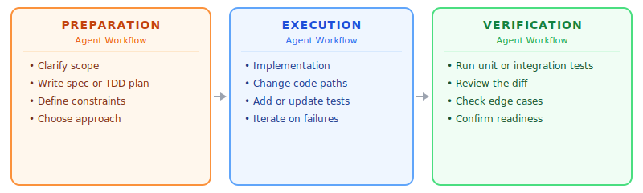
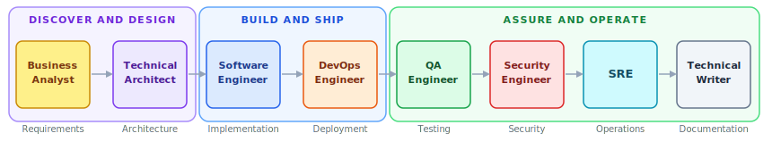

# Software Engineering Agent Playbook

A library of **agents**, **skills**, and **guidelines** for AI software engineering assistants — plus thin adapters that map the core definitions to Claude Code, GitHub Copilot, Cursor, and others.

The playbook covers the full software development lifecycle — from requirements and architecture through implementation, testing, security, deployment, operations, and documentation. Each SDLC stage has a dedicated agent with its own behavioral rules and skills, so no stage is a gap and no agent carries responsibility beyond its scope.

## Model

Three layers:

| Layer | Location | Loaded | Purpose |
|---|---|---|---|
| **Skills** | `core/skills/<agent>/` | On demand | Task execution invoked when needed |
| **Guidelines** | `core/knowledge/` | Always available | Normative rules agents consult during execution |
| **Adapters** | `adapters/` | — | Maps core to each tool's native format |

Behavioral rules live inline in each agent's `agent.md`. Skills define what an agent **does**. Guidelines define how an agent **behaves** during execution — coding standards, security rules. Adapters translate both into the format each platform understands, with no content of their own. Tool access (what an agent can invoke: bash, web search, file reads) is declared in each adapter's frontmatter and configured per project.


## Agent Workflow

Every agent — regardless of role — operates in three internal phases. This is not a hand-off model between humans and AI; it is the shape of a single agent's workflow, applied consistently across all eight roles.

| Phase | What happens |
|---|---|
| **Pre-work** | Clarify scope and gather inputs. Produce a plan, spec, threat model, or design before any primary deliverable is created. Gate: do not move to execution without a defined target. |
| **Execution** | Produce the primary deliverable — code, architecture, tests, infrastructure, documentation — against the pre-work spec. |
| **Post-work** | Verify the deliverable against the pre-work plan. Surface gaps, failures, or required follow-up before declaring the work done. |

All eight agents follow this pattern. The specific skills differ by role:

| Agent | Pre-work | Execution | Post-work |
|---|---|---|---|
| **Business Analyst** | interview-me, idea-refine, innovation-discovery, requirements-gathering, process-analysis | user-story, prd-writing, roadmap | estimation, sprint-planning |
| **Technical Architect** | feasibility-analysis | system-design, adr-writing, technical-spec | architecture-review |
| **Software Engineer** | spec-writing, tech-debt | incremental-implementation, source-driven-development, debugging, refactoring, migration, dependency-update, performance-optimization | code-review, code-simplification, doubt-driven-development, agent-output-review |
| **QA Engineer** | test-planning | test-writing, browser-testing, performance-testing, exploratory-testing | bug-report |
| **Security Engineer** | threat-modeling | security-audit, vulnerability-assessment, dependency-vulnerability | compliance-review |
| **DevOps Engineer** | pipeline-design, infrastructure-as-code | containerization, build-optimization | deployment |
| **SRE** | observability, alerting, capacity-planning, runbook | incident-response, root-cause-analysis | post-mortem |
| **Technical Writer** | — | api-docs, user-guide, runbook-writing, onboarding-guide, changelog | stakeholder-trust |

Each agent's composite skill is the canonical end-to-end workflow for its primary task, chaining pre-work through post-work in a single invocation.



## Agents

Eight agents cover the full software development lifecycle:

| Agent | Composite Workflow | Pre-work | Execution | Post-work |
|---|---|---|---|---|
| **Business Analyst** | requirements-to-prd | interview-me, idea-refine, innovation-discovery, requirements-gathering, process-analysis | user-story, prd-writing, roadmap | estimation, sprint-planning |
| **Technical Architect** | design-and-document | feasibility-analysis | system-design, adr-writing, technical-spec | architecture-review |
| **Software Engineer** | ship-feature, intrapreneur-workflow | spec-writing, tech-debt | incremental-implementation, source-driven-development, debugging, refactoring, migration, dependency-update, performance-optimization | code-review, code-simplification, doubt-driven-development, agent-output-review |
| **QA Engineer** | feature-validation | test-planning | test-writing, browser-testing, performance-testing, exploratory-testing | bug-report |
| **Security Engineer** | security-review | threat-modeling | security-audit, vulnerability-assessment, dependency-vulnerability | compliance-review |
| **DevOps Engineer** | ship-service | pipeline-design, infrastructure-as-code | containerization, build-optimization | deployment |
| **SRE** | incident-to-action | observability, alerting, capacity-planning, runbook | incident-response, root-cause-analysis | post-mortem |
| **Technical Writer** | document-release | — | api-docs, user-guide, runbook-writing, onboarding-guide, changelog | stakeholder-trust |

Together the eight agents span the full SDLC: requirements → architecture → implementation → testing → security → deployment → operations → documentation. Each agent's behavioral rules are defined inline in its `agent.md`. Available skills are declared in the agent's `SKILLS.md` — a QA Engineer has no awareness of deployment skills, and vice versa.



## Skill Hierarchy

Skills are either **atomic** (single responsibility, maps to one phase) or **composite** (chain multiple atomic skills across phases):

```
core/skills/software-engineer/
  spec-writing.md         ← atomic / pre-work: produces the implementation spec before coding begins
  code-review.md          ← atomic / post-work: reviews human-authored code against standards
  agent-output-review.md  ← atomic / post-work: verifies AI-generated code for drift, logic gaps, missing edge cases
  debugging.md            ← atomic / execution: diagnoses and fixes a specific bug
  ship-feature.md         ← composite: spec-writing (pre-work) → implementation (execution) → code-review (post-work)
  intrapreneur-workflow.md ← composite: innovation-discovery (pre-work) → spec-writing → build → agent-output-review (post-work) → stakeholder communication
```

Atomic skills map to a specific phase — pre-work, execution, or post-work. Composite skills chain atomic skills across phases to form a complete workflow. Building new workflows means composing existing atomics, not writing new monolithic prompts.

## Adapters

Adapters are thin by design — each one imports from `core/` using the tool's native syntax:

| Tool | Native format | Import mechanism |
|---|---|---|
| Claude Code | `.claude/agents/*.md` with YAML frontmatter | `@path/to/file` |
| GitHub Copilot | `.github/` chat participants | Tool-specific |
| Cursor | `.cursor/rules/*.md` | `@path/to/file` |

No content lives in adapters. Updating a core skill or guideline is automatically reflected in all adapters that import it.

## Structure

### Core

```
core/
  agents/
    business-analyst/
      agent.md            ← role, behavioral rules, pointer to SKILLS.md
      SKILLS.md           ← index of skills this agent can invoke
    technical-architect/
      agent.md
      SKILLS.md
    software-engineer/
      agent.md
      SKILLS.md
    qa-engineer/
      agent.md
      SKILLS.md
    security-engineer/
      agent.md
      SKILLS.md
    devops-engineer/
      agent.md
      SKILLS.md
    sre/
      agent.md
      SKILLS.md
    technical-writer/
      agent.md
      SKILLS.md

  knowledge/
    development-best-practices.md  ← design principles, coding standards, and team conventions
    security-guidelines.md         ← developer-facing rules for writing secure code

  skills/
    business-analyst/
      interview-me.md           ← atomic / pre-work: extract what a stakeholder actually wants through structured elicitation
      idea-refine.md            ← atomic / pre-work: turn a vague idea into a scoped proposal through divergent/convergent thinking
      requirements-gathering.md
      user-story.md
      prd-writing.md
      process-analysis.md
      roadmap.md
      sprint-planning.md
      estimation.md
      innovation-discovery.md   ← explore unspoken needs before a ticket exists
      requirements-to-prd.md    ← composite: requirements-gathering → user-story → prd-writing
    technical-architect/
      system-design.md
      architecture-review.md
      adr-writing.md
      technical-spec.md
      feasibility-analysis.md
      design-and-document.md    ← composite: system-design → adr-writing → technical-spec
    software-engineer/
      spec-writing.md
      tech-debt.md
      incremental-implementation.md ← atomic / execution: build in thin vertical slices — implement, test, verify, commit per slice
      source-driven-development.md  ← atomic / execution: ground framework decisions in official docs with citations
      debugging.md
      refactoring.md
      migration.md
      dependency-update.md
      performance-optimization.md   ← atomic / execution: identify and fix bottlenecks through measurement, not intuition
      code-review.md
      code-simplification.md        ← atomic / post-work: reduce complexity in working code while preserving exact behaviour
      doubt-driven-development.md   ← atomic / post-work: adversarial review of non-trivial decisions before they stand
      agent-output-review.md        ← atomic / post-work: verifies AI-generated code for drift, logic gaps, missing edge cases
      ship-feature.md               ← composite: spec-writing → code-review → testing
      intrapreneur-workflow.md      ← composite: discovery → spec → build → review → trust
    qa-engineer/
      test-planning.md
      test-writing.md
      browser-testing.md        ← atomic / execution: test and debug web UI using live browser runtime data
      bug-report.md
      performance-testing.md
      exploratory-testing.md
      feature-validation.md     ← composite: test-planning → test-writing → exploratory-testing → bug-report
    security-engineer/
      security-audit.md
      threat-modeling.md
      vulnerability-assessment.md
      dependency-vulnerability.md
      compliance-review.md
      security-review.md        ← composite: threat-modeling → security-audit → vulnerability-assessment
    devops-engineer/
      pipeline-design.md
      deployment.md
      infrastructure-as-code.md
      containerization.md
      build-optimization.md
      ship-service.md           ← composite: pipeline-design → containerization → infrastructure-as-code → deployment
    sre/
      observability.md
      alerting.md
      incident-response.md
      post-mortem.md
      capacity-planning.md
      runbook.md
      root-cause-analysis.md
      incident-to-action.md     ← composite: incident-response → root-cause-analysis → post-mortem
    technical-writer/
      api-docs.md
      user-guide.md
      runbook-writing.md
      onboarding-guide.md
      changelog.md
      stakeholder-trust.md      ← atomic: communicate outcomes and build trust with stakeholders
      document-release.md       ← composite: api-docs → changelog → stakeholder-trust

adapters/
  claude/
    *.md                  ← one file per agent: YAML frontmatter + @-imports from core/
    SPEC.md               ← architecture decisions for the Claude Code adapter
    MCP.md                ← catalogue of MCP server options for optional tool integrations
    examples/
      mcp.json            ← annotated example .mcp.json for project setup
  copilot/
  cursor/
```

## Quick Start

**Claude Code**

See [`adapters/claude/GETTING-STARTED.md`](adapters/claude/GETTING-STARTED.md) for the full setup guide, including:
- Two deployment models (fork vs. submodule)
- Writing your project's `CLAUDE.md`
- Multi-role configuration for developers who wear more than one hat
- Role selection guide (which agent and skill to invoke for each task)
- Customizing the knowledge files for your team

Short version:
1. Fork or clone this repo — your project code lives alongside `core/`.
2. Copy `adapters/claude/` into `.claude/agents/`.
3. Create a `CLAUDE.md` pointing to your architecture docs, runbooks, and issue tracker.
4. Optionally copy `adapters/claude/examples/mcp.json` to `.mcp.json` for GitHub, Slack, or database integrations.

**GitHub Copilot** — copy `adapters/copilot/` files into `.github/` (adapter files coming soon)

**Cursor** — copy `adapters/cursor/` files into `.cursor/rules/` (adapter files coming soon)

## Principles

- **Minimal core**: skills and two guideline files — nothing else
- **Non-redundant**: each skill and guideline has one authoritative source
- **On-demand skills**: skills are invoked when needed, never always-loaded
- **Composable**: atomic skills combine into composite skills without duplication
- **Agent-scoped behavior**: each agent defines only the behavioral rules relevant to its role
- **Full SDLC coverage**: every stage from requirements to documentation has a dedicated agent and skills

## Contributing

1. All content goes in `core/` — never in `adapters/`
2. Skills go in `core/skills/<agent>/` — never nested inside `core/agents/`
3. Skills must be either atomic (single task) or explicitly composite (declare which sub-skills they invoke)
4. New agents must define behavioral rules inline in `agent.md` and list available skills in `SKILLS.md`
5. Adapters require no manual updates — they reflect `core/` automatically via imports

## License

Apache 2.0 — see LICENSE file
